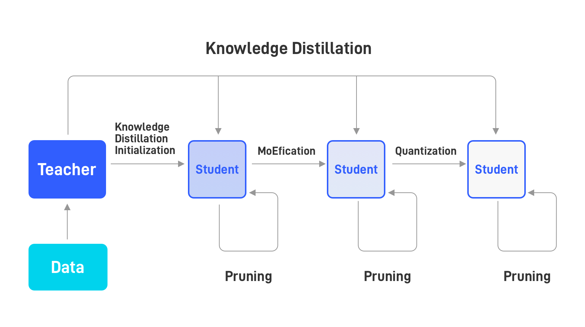

# Introduction

[BMCook](https://github.com/OpenBMB/BMCook) is a model compression toolkit for large-scale pre-trained language models (PLMs), which integrates multiple model compression methods. You can combine them in any way to achieve the desired speedup. Specifically, we implement the following four model compression methods:

## Model Quantization 

Quantization compresses neural networks into smaller sizes by representing parameters with low-bit precision, e.g., 8-bit integers (INT8) instead of 32-bit floating points (FP32). It reduces memory footprint by storing parameters in low precision and accelerating the computation in low precision. In this toolkit, we target quantization-aware training, which simulates the computation in low precision during training to make the model parameter adapt to low precision.

In this toolkit, we quantize all linear transformations in the model, which cover over 90% of Transformer computation. For token embedding and attention matrices, we still use floating points, which ensure good performance with little computation cost.

## Model Pruning

Pruning compresses neural networks by removing unimportant parameters. According to the granularity of pruning, it is categorized into structured pruning and unstructured pruning. In this toolkit, we implement both pruning methods.

For unstructured pruning, we implement 2:4 sparsity patterns to utilize the TensorCore of NVIDIA GPUs, which brings 1x speedup.

## Knowledge Distillation

Knowledge distillation aims to alleviate the performance degradation caused by model compression. It provides a more informative training objective than the conventional pre-training does. 

In this toolkit, we implement the knowledge distillation losses based on output logits, intermediate hidden states, and attention matrices. In practice, we find that the loss based on output logits is enough.

## Model MoEfication

MoEfication utilizes the sparse activation phenomenon in PLMs and splits the feed-forward networks into several small expert networks for conditional computation of PLMs. Please refer to [this paper](https://arxiv.org/abs/2110.01786) for more details.

## Overall Framework

